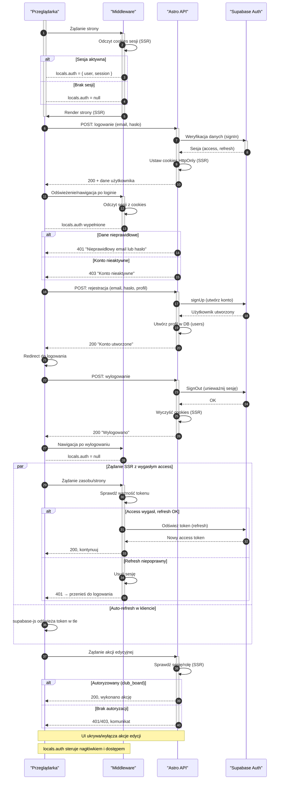

<authentication_analysis>

1. Przepływy autentykacji (na bazie PRD i spec):

- Rejestracja: formularz → API rejestracji → Supabase signUp → profil w DB.
- Logowanie: formularz → API logowania (SSR-first) lub client-first.
- Wylogowanie: akcja → API wylogowania → unieważnienie sesji.
- Odzyskiwanie hasła: żądanie resetu → mail → reset hasła → login.
- Weryfikacja sesji (SSR): middleware czyta ciasteczka → locals.auth.
- Odświeżanie tokenu: SSR przez refresh token lub client auto-refresh.
- Ochrona akcji: API i UI sprawdzają sesję/rolę; publiczny wgląd bez loginu.

2. Aktorzy i interakcje:

- Przeglądarka: wysyła żądania, renderuje UI, wykonuje logowanie.
- Middleware: na każde żądanie tworzy kontekst sesji (locals.auth).
- Astro API: obsługuje logowanie, rejestrację, wylogowanie, me.
- Supabase Auth: weryfikuje dane, zarządza sesjami i tokenami.

3. Weryfikacja i odświeżanie tokenów:

- SSR: @supabase/ssr czyta i odświeża sesję na żądanie (HttpOnly).
- Client: supabase-js auto-odświeża access token w tle.
- Gdy refresh jest nieważny: czyszczenie sesji i wymuszenie logowania.

4. Kroki (skrót):

- Wejście na stronę: middleware ustala locals.auth → UI warunkowy.
- Logowanie: API logowania ustawia cookies → redirect → sesja SSR.
- Wylogowanie: API wylogowania czyści sesję → UI bez edycji.
- Reset hasła: żądanie maila → link → ustawienie nowego hasła.
- Token wygasł: SSR odświeża lub 401 i redirect; client odświeża w tle.
  </authentication_analysis>

<mermaid_diagram>

</mermaid_diagram>
