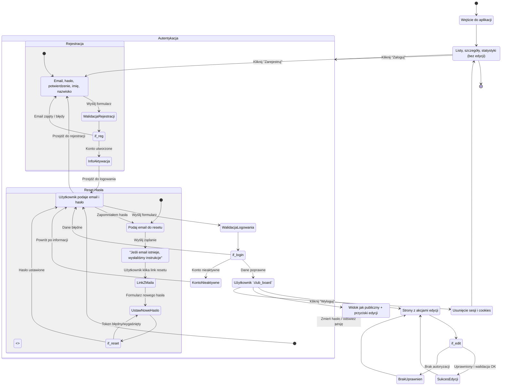

<user_journey_analysis>
1) Ścieżki użytkownika (PRD + spec):
- Przeglądanie bez logowania (US-002): dostęp do list i szczegółów, brak edycji.
- Logowanie (US-001/US-003): przejście na stronę logowania, autoryzacja, powrót.
- Rejestracja (US-003): utworzenie konta, ewentualna aktywacja, przejście do logowania.
- Odzyskiwanie hasła (US-003): żądanie resetu → mail → ustawienie nowego hasła.
- Edycja po zalogowaniu (US-003): dostęp do tworzenia/edycji/usuwania.
- Wylogowanie: powrót do trybu przeglądania bez edycji.

2) Główne podróże i stany:
- NieZalogowany → PrzeglądaniePubliczne → (Login | Rejestracja | ResetHasła)
- Zalogowany (club_board) → PrzeglądanieZMożliwościąEdycji → AkcjeEdycyjne
- Wylogowanie → powrót do NieZalogowany

3) Punkty decyzyjne i alternatywy:
- Logowanie: poprawne dane vs błąd vs konto nieaktywne.
- Rejestracja: email zajęty vs sukces.
- Reset hasła: token poprawny vs niepoprawny/wygaśnięty.
- Akcje edycyjne: autoryzowany vs brak uprawnień.

4) Cel stanów (skrót):
- NieZalogowany: swobodny wgląd, CTA do logowania/rejestracji.
- PrzeglądaniePubliczne: nawigacja po danych, akcje edycyjne ukryte.
- FormularzLogowania/Rejestracji/Resetu: zebranie danych i walidacja.
- Zalogowany: pełen dostęp do akcji edycyjnych `club_board`.
- AkcjeEdycyjne: wykonywanie zmian w danych.
</user_journey_analysis>

<mermaid_diagram>

</mermaid_diagram>
