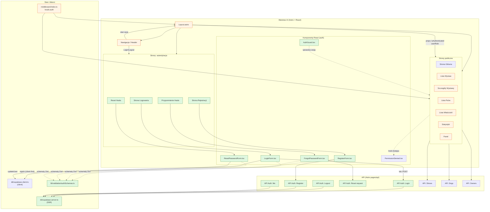

<architecture_analysis>

1. Komponenty (wg PRD i spec):

- Strony: "Strona Logowania", "Strona Rejestracji",
  "Przypomnienie Hasła", "Reset Hasła".
- Layout: `src/layouts/Layout.astro` (nagłówek z Login/Logout,
  stan sesji z SSR).
- Publiczne strony: lista/szczegóły wystaw, psy, właściciele,
  statystyki, dashboard (wgląd bez logowania; edycja wymagająca
  autoryzacji).
- Komponenty React (auth): `LoginForm.tsx`, `RegisterForm.tsx`,
  `ForgotPasswordForm.tsx`, `ResetPasswordForm.tsx`, `AuthGuard.tsx`.
- Wspierające: `PermissionDenied.tsx` (UI dla braku uprawnień).
- Klienci/Sesja: `db/supabase.client.ts` (client),
  `db/supabase.server.ts` (SSR, nowy), `middleware/index.ts`
  (ustawia `locals.auth` i `locals.supabase`).
- Walidacja: `src/lib/validation/authSchemas.ts` (nowy, Zod).
- API (Astro): Auth: Login/Logout/Register/ResetRequest/Me (nowe),
  istniejące: Users/Shows/Dogs/Owners.

2. Główne strony i komponenty:

- Layout + Nawigacja (Login/Logout).
- Strony auth montujące odpowiednie formularze React.
- Strony publiczne przekazujące `isAuthenticated`, `userRole` do
  komponentów edycyjnych i stosujące `AuthGuard`/`PermissionDenied`.

3. Przepływ danych:

- Formularze auth -> `supabase-js` (client-first) lub API (SSR-first).
- Middleware (SSR) wypełnia `locals.auth`; Layout i strony czytają
  stan i renderują odpowiedni UI.
- Strony publiczne korzystają z API domenowych (shows/dogs/owners),
  a akcje edycyjne są chronione przez `AuthGuard` i stan sesji.

4. Opisy funkcjonalności:

- `LoginForm`/`RegisterForm`/`ForgotPasswordForm`/`ResetPasswordForm`:
  walidacja Zod, obsługa błędów UX, integracja auth.
- `AuthGuard`: defensywna ochrona akcji edycyjnych.
- `Layout.astro`: przełącznik Login/Logout, pokazuje użytkownika.
- `middleware` + `supabase.server`: spójna sesja SSR dla UI.
  </architecture_analysis>

<mermaid_diagram>

</mermaid_diagram>
